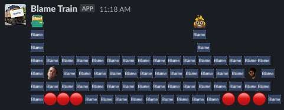

# slack-bot-blametrain
An example slack bot to annoy coworkers

## Requirements
- A [Slack app and command setup](https://api.slack.com/start/overview) to recieve the command
- [Flask server](https://www.digitalocean.com/community/tutorials/how-to-serve-flask-applications-with-uswgi-and-nginx-on-ubuntu-18-04) to recieve the commands

## Instructions
Slack requires a verification token to allow communication between the app and server. The Slack verification token can found in the Slack App Credentials in the apps basic information. Copy the verification token and your slack team ID to the config.json file.

## Example output
